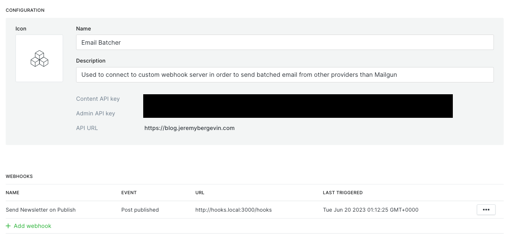
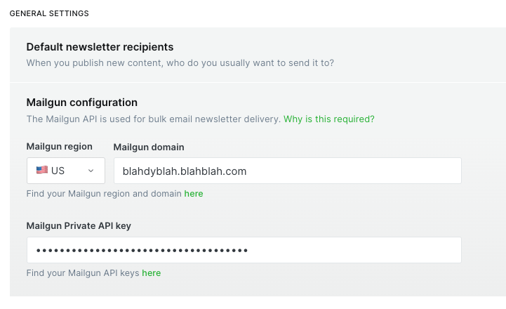

# Ghost CMS Email Batcher
This is a vary basic webhook server built with TypeScript and Express. It can be configured with a self-hosted Ghost instance to batch emails and send them via a third-party email provider (other than Mailgun). 

# Why?
Ghost CMS is a great, FOSS blogging platform, but it lacks the ability to batch emails and send them via third-party email providers other than Mailgun. This webhook server can be used to add this functionality to a self-hosted Ghost instance. I plan to provide a proper implementation of this functionality within the Ghost app in the future and present as a PR to the team, but for now, this is a fine solution.
 

### Configuring your Ghost instance to use this webhook
#### Setup the integration
1. Go to your Ghost admin panel and navigate to the "Integrations" tab.
2. Click the "Add custom integration" button.
3. Give the integration a name (e.g. "Email Batcher") and click the "Create" button.
4. Click the "Add Webhook" button.
5. Select the "Post published" event.
6. Enter the URL of the webhook server (e.g. http://localhost:3000/webhook) and click the "Save" button.

#### "Configure" Mailgun
Sending your posts out via email when you publish them is not an option unless you have configured Mailgun in the email newsletter section of the Ghost admin panel. Obviously we don't have Mailgun credentials, so we need to fake it. To do this, follow these steps:
1. Go to "Settings" in the Ghost admin panel.
2. Click the "Email Newsletter" tab.
3. Under General Settings, expand the "Mailgun" section.
4. Enter fake values into the "Mailgun Domain" and "Mailgun Private API Key" fields. Seriously.

#### You should now see more options available when you go to publish a post
 

### Installation
##### There are two routes to installing this webhook server:
1. Locally
2. Docker

The following environment variables are required regardless of which installation method you choose:
  - __EMAIL_PROVIDER__: The email provider to use. Currently supported providers are postmark and sendgrid.
  - __MAIL_SERVER_API_KEY__: The API key for the email provider.
  - __DATABASE_CONTAINER_NAME__: The name of the MySQL database container.
  - __MYSQL_USER__: The username for the MySQL database.
  - __MYSQL_PASSWORD__: The password for the MySQL database.
  - __MYSQL_DATABASE__: The name of the MySQL database.

#### Local Installation
1. Clone the repository to your local machine.
2. Navigate to the root directory of the project.
3. Install the required dependencies by running `npm install`
4. Set the required environment variables by creating a `.env` file in the root directory of the project. 
5. Start a dev version of the application by running `npm start`.
6. You can also build a production version of the application by running `npm run build` and then run `node dist/ghost_hooks.js` to start the server.

#### Docker Installation
1. Clone the repository to your local machine.
2. Navigate to the root directory of the project.
3. Set the required environment variables by creating a `.env` file in the root directory of the project.
4. Build the Docker image by running `docker build -t ghost-email-batcher .`
5. Run the Docker image by running `docker run -d -p 3000:3000 ghost-email-batcher`

### Usage
To use the application, follow these steps:
1. Create a new post in Ghost
2. Click the "Publish" button 
3. Select the option to publish the post and send it via email
4. Any members that have signed up for that newsletter should receive the post via email

### Caveats
1. This is a janky way to go about this. You can read more about my decision to take this approach in my blog post.
2. Access to the Ghost database is required for this server to work properly.
3. There is no email tracking or analytics available at this time. This is technically possible via deeper integration with third party providers, but it wouldn't ever be integrated into the Ghost admin panel via this webhook, so I've deliberately left it out.
4. All of your posts which use this flow will report as having "failed to send" in the Ghost admin panel. This is because the webhook server is sending the emails, not Ghost. 🤷‍♂️

### Contributing
If you would like to contribute to the application, please follow these steps:
1. Fork the repository to your own GitHub account.
2. Create a new branch for your changes.
3. Make your changes and commit them to your branch.
4. Push your branch to your forked repository.
5. Create a pull request to merge your changes into the main repository.

### License
This application is licensed under the MIT License. See the LICENSE file for more information.